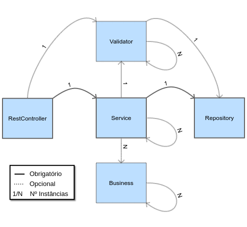

## Requisitos p/ construção e execução da aplicação
* Linux: Ubuntu Linux ou distro baseada
* OpenJDK: 1.8
* Maven: 3.5.2
* Docker
* Docker Compose
* Build do [módulo de arquitetura](https://github.com/Diego-Rocha/diego-library)

## Console
A construção da aplicação,
controle do Docker
e base de dados pode ser controlada diretamente pelo console
Para acessar digite no bash:
```bash
./console
```
Uma tela semelhante a esta deve ser apresentada:
```text
Função:
[b] - Build
   [f/q] - Full/Quick
[d] - Docker
   [u/d] - Up/Down
[l] - Limpar Base
```

## Execução e construção da aplicação
### 1º Subir a base de dados
Sobe o docker com uma base de dados postgres vazia.
Obs.: é extremamente importante que a base esteja ativa para construção da aplicação, pois a mesma é utilizada pelo Hibernate Reverse Engine para gerar as entidades da aplicação.
```bash
./console d u b
```

### 2º Construir a aplicação
```bash
./console b f
```

### 3º Subir a aplicação completa
criará mais 2 contâineres:
 - nginx como loadBalance -> host: http://localhost
 - servidor (back|front)end -> sem acesso externo, somente pelo loadBalance
```bash
./console d u f
```
### Subir aplicação sem docker (opcional)
```bash
java -jar -Dspring.profiles.active=desenvolvimento app/diego-tech/target/diego-tech-server.jar
```

## Base de Dados
### Dados de acesso
* Tipo: Postgres
* Host: localhost:5432
* Base: diego_tech
* Usuário: diego_tech
* Senha: 123456

## Arquitetura

* Backend: SpringBoot, Swagger, Hibernate, Hibernate Reverse Engine, QueryDSL, Flyway, Docker, etc...
* Frontend: HTML5, jQUery, Bootstrap, etc...

### Interação entre camadas do backend


### Pontos de interesse
 * [Testes Unitários](lib/model/entity/src/test) (Necessita build)
 * [Relatório do JaCoCo](lib/model/entity/target/site/jacoco/index.html) (Necessita build)
 	* Aplicado no pacote: io.diego.tech.business
 		* Cobertura de código: Minimo de 75%;
 		* Complexidade Ciclomática: Máximo de 20 por método;
 	* Se uma das métricas não for satisfeita o build do modulo 'entity' falha;
 	
 ### Pontos de Melhoria
  * Colocar testes unitários (bem como JaCoCo) na camada de validação;
  * Melhorar separação das camadas do frontend;
  * Melhorar layout do frontend;
  * Substituir frontend por Angular,Vue ou React por exemplo;
  * Melhorar retorno de mensagem do backend p/ o frontend;
  * Implementar auditoria de base de dados;
  * Implementar autenticação e autorização (Spring Security, JWT);
  * Otimizar tempo de upstart do springboot